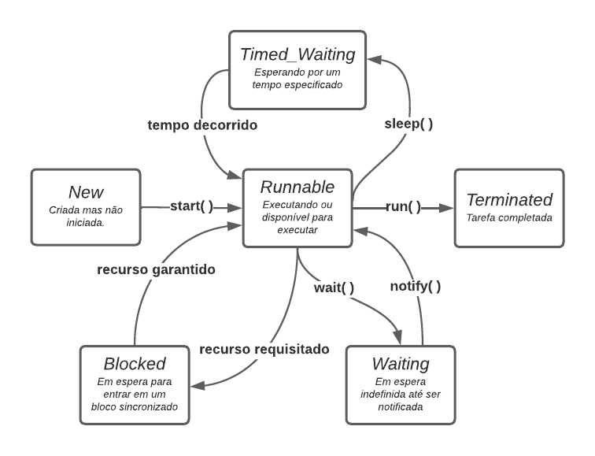

#Concurrency

## Threads

* all operating systems support what is known as **multithreaded processing**.
  * **multithreaded processing** is to allow an application or group of applications to execute _multiple tasks at the same time_.

* A **thread** is the smallest unit of execution that can be scheduled by the operating system.

* A **process** is a _group of associated threads_ that execute in the same _shared environment_.
  * a _single-threaded process_ is one that contains exactly one thread
  * _multithreaded_ process supports more than one thread

* **shared environment**
  * threads in the same process share the same memory space and can communicate directly with one another.

### Concurrency

* **concurrency** is the property of executing multiple threads and processes at the same time
* Operating systems use a thread scheduler to determine which threads
  should be currently executing;
  * applying round-robin schedule, fifo, priority based scheduler, ...
* A context switch is the process of storing a thread’s current state and later restoring the state of the thread to continue execution.
* A thread can interrupt or supersede another thread if it has a higher thread priority than the other thread.
  * A thread priority is a numeric value associated with a thread that is taken into consideration by the thread scheduler when determining which threads should currently be executing.

### Creating Threads

* to define a task for a thread is by using the [Runnable](https://docs.oracle.com/en/java/javase/17/docs/api/java.base/java/lang/Runnable.html) functional interface
 
```java
@FunctionalInterface 
public interface Runnable {
void run();
}
```

* you need to instantiate a _[Thread](https://docs.oracle.com/en/java/javase/17/docs/api/java.base/java/lang/Thread.html)_ and call the method **_start()_**
```java
public class PrimeiraThread {

    public static void main(String[] args) {
        new Thread(() -> System.out.print(" Ola ")).start();
        System.out.print(" Mundo ");
    }
}
```

* Remember that order of  thread execution is not often guaranteed.
  * "Ola Mundo"
  * "Mundo Ola"

```java
 Mundo  Ola
```

```java
public class MultiplasThreads {

    public static void main(String[] args) {
        Runnable imprimirCatalogo = () -> System.out.println("Imprimindo catalogo");
        Runnable imprimirRegistros = () -> {
            for (int i = 0; i < 4; i++)
                System.out.println("Imprimindo registro: " + i);
        };

        System.out.println("inicio");
        new Thread(imprimirCatalogo).start();
        new Thread(imprimirRegistros).start();
        new Thread(imprimirCatalogo).start();
        System.out.println("fim");
    }
}
```

* we have 4 threads

```java
inicio
fim
Imprimindo catalogo
Imprimindo catalogo
Imprimindo registro: 0
Imprimindo registro: 1
Imprimindo registro: 2
Imprimindo registro: 3
```

* Each thread is executed as an asynchronous task.
  * asynchronous, we mean that the thread executing the main() method does not wait for the results of each newly created thread before continuing
  * The opposite of this behavior is a synchronous task in which the program waits

### Types of Threads

* A **_system thread_** is created by the Java Virtual Machine (JVM) and runs in the background of the application.
* a **_user-defined thread_** is one created by the application developer to accomplish a specific task.
  * main() method is an example, _single-threaded application_
* System and user-defined threads can both be created as daemon threads
  * A **_daemon_** thread is one that will not prevent the JVM from exiting when the program finishes.
  * method _setDaemon()_

```java
public class ThreadComPause {

    public static void pause() {
        try {
            Thread.sleep(2_000); // pausar por 2 segundos
        } catch (InterruptedException e) {}
        System.out.println("Thread finalizada");
    }

    public static void main(String[] unused) {
        var tarefa = new Thread(() -> pause()); // Cria thread

        tarefa.start(); // Inicia thread
        System.out.println("Fim do programa!");
    }
}
```

```java
Fim do programa!
Thread finalizada
```

* method _daemon()_

```java
public class ThreadDaemonComPause {

    public static void pause() {
        try {
            Thread.sleep(2_000); // pausar por 2 segundos
        } catch (InterruptedException e) {}
        System.out.println("Thread finalizada");
    }

    public static void main(String[] unused) {
        var tarefa = new Thread(() -> pause()); // Cria thread
        tarefa.setDaemon(true); //Thread daemon
        tarefa.start(); // Inicia thread
        System.out.println("Fim do programa!");
    }
}
```

```java
Fim do programa!
```

### Thread's Life Cycle

* method _getState()_ implies one of these [states](https://docs.oracle.com/en/java/javase/17/docs/api/java.base/java/lang/Thread.State.html):
  * NEW
    * when we instantiate a thread;
  * RUNNABLE
    * when we call the _start()_ method
    * not necessarily is running
  * BLOCKED
    * when the thread wait to access a synchronized block or resource
  * WAITING
    * when the thread is waiting a signal of other thread
  * TIMED_WAITING
    * when we use the _sleep()_ method
  * TERMINATED
    * when the thread has executed your task, it is not possible to re-run the same thread



### Pooling with Sleep
* _Polling_ is the process of intermittently checking data at some fixed interval.
* method _sleep()_ transition _RUNNABLE_ and _TIMED_WAITING_ 

```java
public class EnviarMensagemComSleep {

    private static boolean mensagemEnviada = false;

    public static void main(String[] a) {

        new Thread(() -> {
            try {
                Thread.sleep(2000); //2 segundos
                mensagemEnviada = true;
            } catch (InterruptedException e) {
                System.out.println("thread Interrompida!");
            }
        }).start();

        while (!mensagemEnviada) {
            System.out.println("Enviando mensagem...");
            try {
                Thread.sleep(500); // 500 milissegundos
            } catch (InterruptedException e) {
                System.out.println("main interrompido!");
            }
        }
        System.out.println("Mensagem enviada!!");
    }
}
```
```java
Enviando mensagem...
Enviando mensagem...
Enviando mensagem...
Enviando mensagem...
Mensagem enviada!!
```

### Interrupting a Thread

* method _interrupt()_
  * Calling interrupt() on a thread in the TIMED_WAITING or WAITING state causes the main() thread to become RUNNABLE again, triggering an InterruptedException.

```java
public class EnviarMensagemComInterrupt {

    private static boolean mensagemEnviada = false;

    public static void main(String[] a) {

        final var mainThread = Thread.currentThread();

        new Thread(() -> {
            try {
                Thread.sleep(2000); //2 segundos
                mensagemEnviada = true;
                mainThread.interrupt();
            } catch (InterruptedException e) {
                System.out.println("thread Interrompida!");
            }
        }).start();

        while (!mensagemEnviada) {
            System.out.println("Enviando mensagem...");
            try {
                Thread.sleep(5000); // 5 segundos
            } catch (InterruptedException e) {
                System.out.println("main interrompido!");
            }
        }
        System.out.println("Mensagem enviada!!");
    }
}
```

```java
Enviando mensagem...
main interrompido!
Mensagem enviada!!
```


## The Concurrency API

### Single-Thread Executor

### Shutting Downs a Thread Executor

### Submitting Tasks

### Waiting for Results